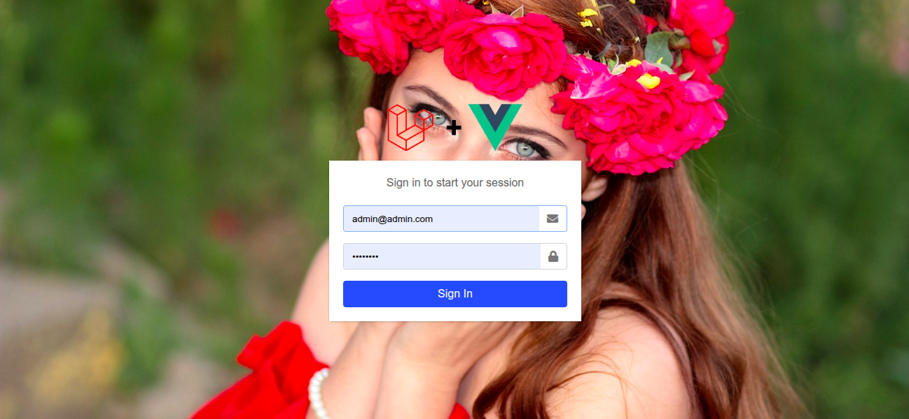
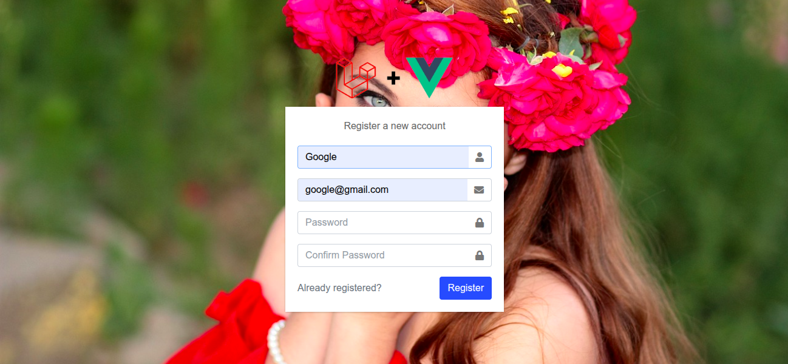
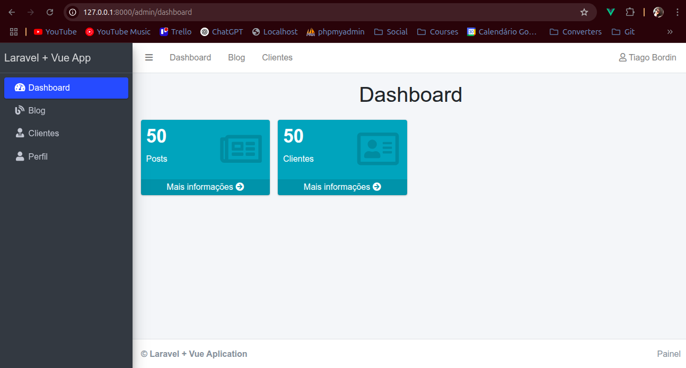
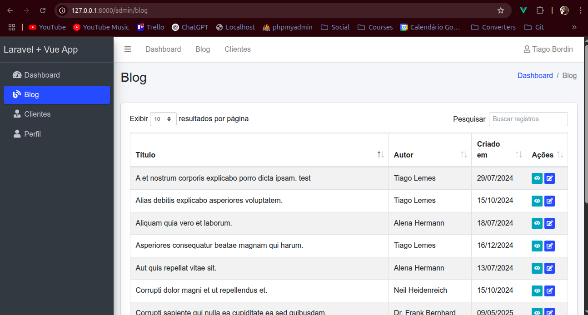
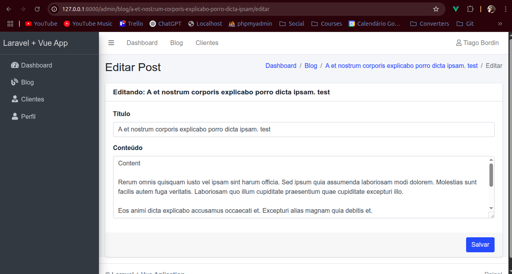
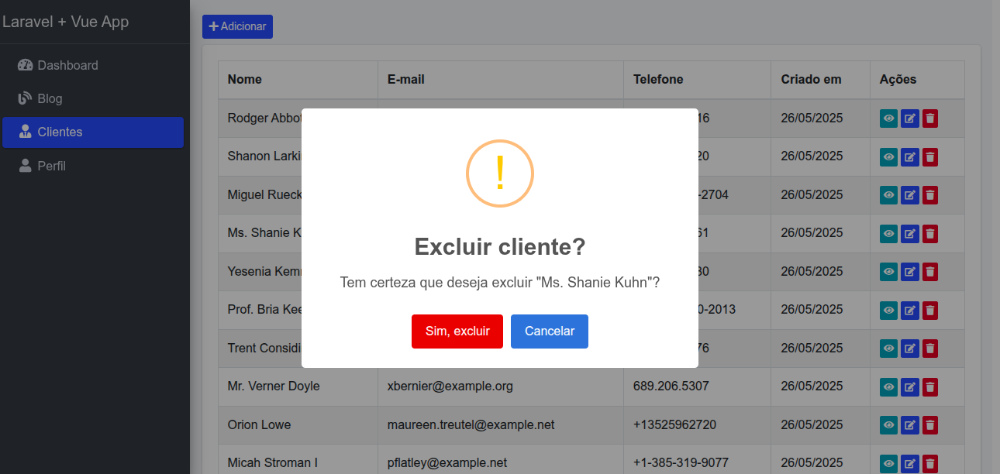
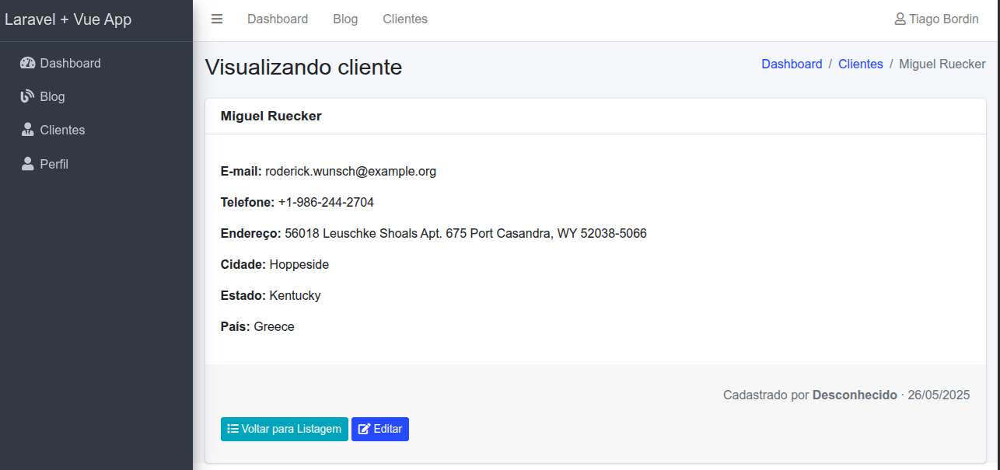

        


# Projeto Laravel + Vue 

## Sobre o Projeto

Este projeto busca ser uma base genérica para outros projetos web usando Vue 3, Laravel 12, MySQL e Inertia. Utiliza o template AdminLTE, Bootstrap 4 e traz alguns cadastros prontos por padrão.

Serve como base de início ou estudo para outros projetos, trazendo o básico como cadastros simples, sistemas de permissões, criação de módulos e etc. 

Está mantido sob a licença DWTFYW (Do Whatever The F*** You Want)

Qualquer ajuda, crítica positiva ou destrutiva, elogios ou xingamentos, contribuições, serão muito bem vindos.

## Sobre o Laravel

Laravel é um framework PHP moderno com sintaxe elegante. Ele facilita tarefas comuns de desenvolvimento como:

- [Sistema de rotas simples e rápido](https://laravel.com/docs/routing)
- [Container de injeção de dependências](https://laravel.com/docs/container)
- [ORM poderoso (Eloquent)](https://laravel.com/docs/eloquent)
- [Migrações de banco de dados](https://laravel.com/docs/migrations)
- [Filas, eventos, jobs e mais](https://laravel.com/docs)

## Documentação

- [Documentação oficial](https://laravel.com/docs)
- [Laracasts (vídeo aulas)](https://laracasts.com)
- [Laravel Bootcamp](https://bootcamp.laravel.com)

## Como iniciar este projeto (Laravel + Vue + Inertia.js)

Siga os passos abaixo para rodar o projeto localmente:

- Clonar o projeto:
```git clone https://github.com/tiagoskaterock/laravel-vue-project```

- Entrar no diretório
```cd laravel-vue-project```

- Criar arquivo de configuração .env a partir do .ev.example
```cp .env.example .env```

- Baixar a pasta vendor com os pacotes necessários para o projeto
```composer install```

- Gerar uma chave para o projeto
```php artisan key:generate```

- Rodar as migrações para criar o banco de dados (Necessário ter completado a configuração no arquivo .env)
```php artisan migrate```

- Instalar pacotes Javascript necessários
```npm install```

- Iniciar o servidor de desenvolvimento Vite
```npm run de```

- Iniciar o servidor de desenvolvimento Laravel
```php artisan serve```

- Crie um usuário, caso não exista, na rota 
`/register`


#### Login


#### Register


#### Dashboard


#### Blog


#### Editar Post


#### Excluir Cliente


#### Detalhes Cliente

